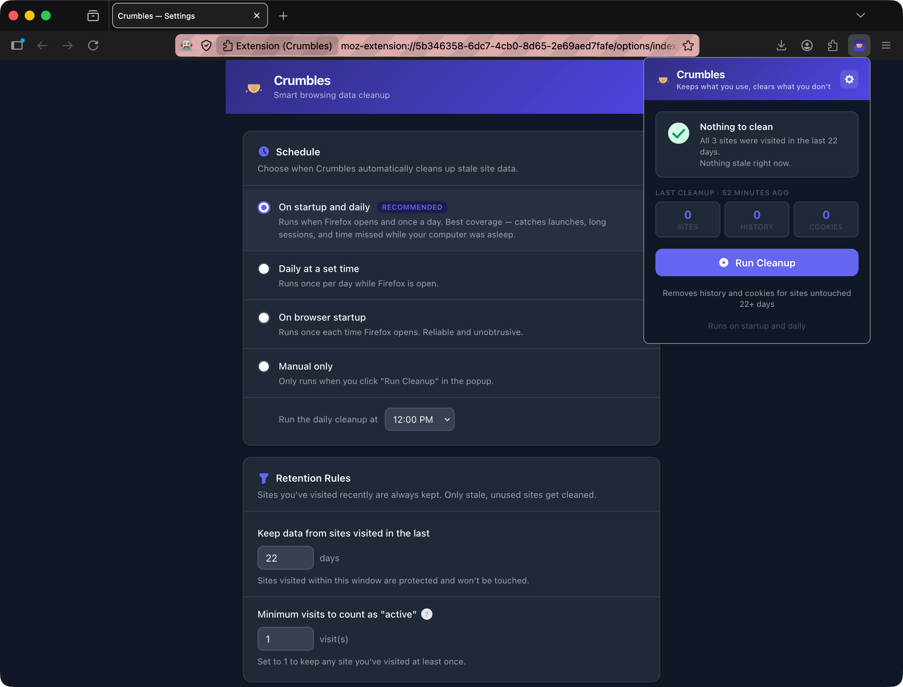

<a href="https://extension.js.org" target="_blank" rel="noopener noreferrer"></a>

# 🍰 Crumbles

> **Keeps what you use, clears what you don't.**

Crumbles cleans up your browser on a rolling basis. Instead of wiping everything, it removes history, cookies, and site data for the sites you've stopped visiting, and leaves the ones you still use alone.



## Local development

### Option 1: live dev (recommended)

This builds the extension, opens Firefox with it loaded into a temporary profile, and reloads on every change:

```bash
bun install                          # first time only
bun run dev -- --browser=firefox     # bun run dev --browser firefox also works
```

Edit anything under `src/` and the extension reloads on its own. Open the popup from the toolbar, or reach Settings from the popup's gear icon.

### Option 2: load the build manually

To load it into your own Firefox profile instead:

```bash
bun install
bun run build:firefox                # outputs to dist/firefox/
```

Then in Firefox:

1. Go to `about:debugging#/runtime/this-firefox`
2. Click **Load Temporary Add-on…**
3. Select `dist/firefox/manifest.json`

> Firefox drops temporary add-ons when it restarts, so you'll re-load it each session during development.

## Commands

```bash
bun run dev                 # dev mode (add -- --browser=<chrome|firefox|edge>)
bun run build               # production build, Chrome by default
bun run build:firefox       # production build for Firefox
bun run build:edge          # production build for Edge
bun run preview             # preview the production build
```

## Learn more

Crumbles is built with [Extension.js](https://extension.js.org). See the [docs](https://extension.js.org).
